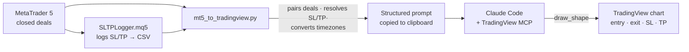

# MT5 → TradingView Script

**Pull your closed XAU/USD trades out of MetaTrader 5 and draw them on a TradingView chart automatically — entry, exit, stop-loss and take-profit — through an MCP-powered drawing agent.**

After a trading week, reviewing your executions means manually re-plotting every position on the chart. This tool removes that busywork: it reads the week's closed trades straight from the MT5 terminal, reconstructs each position (including the *original* SL and the *final* TP), converts every timestamp to the exact Unix seconds TradingView expects, and hands a ready-to-draw instruction set to an MCP that renders the lines on the chart.

> **Scope.** Standalone review tool for discretionary XAU/USD trading. It reads from MT5 and produces drawing instructions — it never places, modifies, or closes orders.

---

## The story — why I built this

I journal my trading by saving a chart image of every session with the trades I took marked on it — that's how I review my decisions later. For a long time the marking was manual: every weekend I'd sit down, read each closed position off my broker, and hand-plot it on the chart in TradingView, one line at a time. It worked, but copying numbers by hand every single week is exactly the kind of thing that should be automated — so I set out to automate it.

It turned out harder than expected. The data I most needed for review — the **original stop-loss** (the one you first set, before any trailing) and the **take-profit you had set** — often isn't there to read. Your broker keeps it, but **MetaTrader 5 doesn't**: MT5's history is accounting-oriented. It stores the price you entered at and the price you exited at, and little else. The initial SL, the last TP, the gap between what you planned and what actually happened — the parts that matter for *trading* review rather than bookkeeping — are gone the moment you trail a stop or close early.

That limitation is why this project has two halves: a small **Expert Advisor** that captures those levels live while you trade, and a **script** that later reads them back and rebuilds each position on the chart.

## How it works



1. **An Expert Advisor (`SLTPLogger.mq5`)** runs on the MT5 chart and appends every stop-loss / take-profit change to a CSV, keyed by `position_id`. MT5's deal history doesn't retain the *original* SL once a position is closed, so this log is what lets the tool recover the real risk levels afterwards.
2. **`mt5_to_tradingview.py`** connects to the terminal, fetches the closed XAU/USD deals for the chosen business week, and pairs entry/exit deals into complete trades. For each one it resolves the entry, exit, SL and TP (falling back to configurable defaults when the log has no row), and computes an optional "exit line".
3. **Timestamps** are the tricky part. MT5 encodes deal times as server-local time labelled as UTC. The tool auto-detects the broker's GMT offset (calendar-based EET/EEST heuristic, cross-checked against a live tick) and converts everything to true Unix **seconds** UTC — the unit the TradingView MCP's `draw_shape` expects.
4. **The result is a structured prompt** copied to the clipboard (with a Notepad fallback). You paste it into Claude Code (the recommended client), which has the TradingView MCP active, and it draws the positions on the chart.

## What it draws (and how you finish it)

Because the tool can't invoke TradingView's native long/short position tool, it draws each trade as a set of horizontal lines that you then "upgrade" with a couple of clicks:

- **Black line** — entry price.
- **Red line** — your *first* stop-loss (the original risk, before any trailing).
- **Green line** — the *last* take-profit you had set.
- **Purple line** — only appears when your actual exit differed from both the TP and the SL (a manual close or a trailing exit); it marks the price you actually got out at.

The workflow: run the script, let it draw the lines, then drop TradingView's long/short tool over them — snap the entry, stop and target onto the black/red/green lines — and keep the purple line as the real exit. In a few seconds you go from raw numbers to a fully marked-up review chart.

## Why the Expert Advisor (and what you need to run it)

`SLTPLogger.mq5` is a tiny Expert Advisor that runs inside MetaTrader and writes every SL/TP change to a CSV as it happens. It exists to capture exactly what MT5's API won't hand back later: the original stop-loss and the take-profit you set. The script reads that CSV to rebuild the real risk/target levels for each trade.

In practice:

- Install the EA once in the **MT5 desktop app** (compile it in MetaEditor, attach it to a chart) and keep it running while you trade.
- You can still place your trades from your **phone** — the EA doesn't care where the order comes from — as long as the desktop app is open with the EA running, so it can log the levels in real time.

## The TradingView bridge — credit

The actual on-chart drawing is done by the **[`tradingview-mcp`](https://github.com/tradesdontlie/tradingview-mcp)** MCP server, created by **[tradesdontlie](https://github.com/tradesdontlie)**. This project does **not** reimplement any of that — it builds the MT5 → prompt half of the pipeline and relies on their MCP for the TradingView side. All credit for the TradingView drawing/automation layer goes to them.

## Why the batching (a real gotcha worth knowing)

TradingView only accepts and renders drawings for candles that are **inside the current viewport**. At the 1-minute timeframe only ~5 days of candles fit on screen, so a whole week can't be drawn in one shot — off-screen lines are silently dropped. The tool works around this by pushing trades in small batches (e.g. the first 2 days, then the next 3) that stay within what's visible.

A second, related quirk: the MCP's `draw_shape` returns `success` even when a line didn't actually land, and TradingView drops drawings when it receives too many at once (~16 in parallel fails; ≤6 per batch is reliable). The generated prompt instructs the agent to draw **sequentially in small batches** rather than trusting the `success` response.

## Requirements

- Windows with **MetaTrader 5** (terminal logged into an account)
- **Python 3.10+**
- Python packages: see [`requirements.txt`](requirements.txt) — `MetaTrader5`, `pytz`, `pyperclip`
- [Claude Code](https://claude.com/claude-code) **(recommended)** with the [`tradingview-mcp`](https://github.com/tradesdontlie/tradingview-mcp) server configured — or any MCP-capable client that can run that server and follow the drawing prompt
- The TradingView desktop app
- The `SLTPLogger.mq5` Expert Advisor attached and running in the MT5 desktop app while you trade (see [Why the Expert Advisor](#why-the-expert-advisor-and-what-you-need-to-run-it))

## Setup

1. Copy `config.example.json` to `config.json` and edit the paths/symbols for your setup (in particular `sltp_log_path`, which points at your MT5 `Common\Files\sltp_log.csv`).
2. Attach `SLTPLogger.mq5` to a chart in MT5 (compile it in MetaEditor first). It starts logging SL/TP changes to the CSV.
3. Install the Python dependencies: `pip install -r requirements.txt`.
4. Set up the `tradingview-mcp` server in Claude Code following [its instructions](https://github.com/tradesdontlie/tradingview-mcp).

## Configuration

`config.json` (copied from `config.example.json`) is where you adapt the tool to your setup — nothing is hardcoded to a region:

- `user_timezone` — your IANA timezone, e.g. `Asia/Kolkata`, `Europe/London`, `America/New_York`. All trade times are converted to this zone.
- `symbol_mt5` / `symbol_tradingview` — your broker's symbol on each platform (e.g. `XAUUSD` and `OANDA:XAUUSD`).
- `sltp_log_path` — path to your MT5 `Common\Files\sltp_log.csv` (where the EA writes).
- `server_offset_override` — leave `null` to auto-detect the broker's GMT offset (tuned for EET/EEST brokers like ICMarkets). If your broker isn't EET, set this to its fixed GMT offset (e.g. `2`).
- `default_sl_points` / `default_tp_points` — fallback SL/TP distance (in points) when the EA log has no row for a trade.

**Other instruments.** This tool is built and tested **only for XAU/USD (gold)**. It will technically run on any symbol you set via `symbol_mt5` / `symbol_tradingview`, but the **SL/TP fallback** — the default levels drawn when the EA log has no data for a trade — is calibrated to gold's price scale and has **not** been tested on other instruments, so don't rely on those fallback lines outside XAU/USD. Full multi-instrument support isn't there yet. It processes one symbol per run.

## Usage

```bash
python mt5_to_tradingview.py
```

Or double-click `Run Terminal.bat` (it checks/installs deps, then runs the script). Pick the week or day range from the menu; the prompt is generated and copied to your clipboard. Open Claude Code, paste with `Ctrl+V`, and press Enter — it verifies the chart and draws the trades.

**Prefer a window?** Run `python gui.py` (or double-click `Run App.bat`) for a lightweight desktop GUI over the same engine — pick a week and range from dropdowns, click **Generate & copy prompt**, and paste into Claude Code. The console version stays the default; the GUI is just a friendlier door. No extra dependencies (Tkinter ships with Python).

## Design notes

- **Separation of concerns.** The data engine (fetch, pair, resolve SL/TP, convert time, build prompt) is fully decoupled from the CLI menu, so a GUI could replace the console layer without touching the core.
- **Robust timezone detection.** The broker offset is anchored on a calendar heuristic and only *cross-checked* against the live tick (which depends on the PC clock and can lie) — never trusted blindly. A `server_offset_override` in config wins unconditionally.
- **Atomic, retry-safe CSV cleanup.** Old cache rows are pruned with a tempfile + atomic replace, retried if the EA briefly holds the file open.

## Roadmap

- A fully automated drawing path (no LLM in the loop) — prototyped separately, but not yet working (the MCP reports success without actually drawing).
- Multi-symbol runs in a single pass.

## Spanish version

A full Spanish version lives in [`spanish/`](spanish/) — **same features and fixes** as the English one (stop-loss / exit-line logic, TP rule, robust EA-log reading, reordered menu), with the menu and comments in Spanish. Use whichever you prefer; both behave the same. (The GUI is English-only.)

## Credits

- **TradingView drawing/automation** — the [`tradingview-mcp`](https://github.com/tradesdontlie/tradingview-mcp) server by [tradesdontlie](https://github.com/tradesdontlie). All on-chart drawing is done by their MCP; this project does not reimplement any of it.
- **MT5 → prompt pipeline, the `SLTPLogger.mq5` Expert Advisor, and the CLI/GUI** — built for this project.
